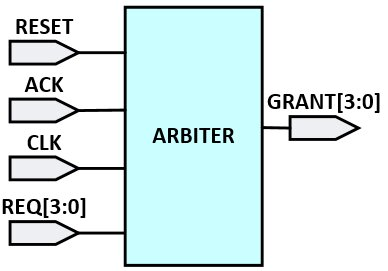

<a id="readme-top"></a>

[![Contributors][contributors-shield]][contributors-url]
[![Forks][forks-shield]][forks-url]
[![Stargazers][stars-shield]][stars-url]
[![Issues][issues-shield]][issues-url]
[![Unlicense License][license-shield]][license-url]
[![LinkedIn][linkedin-shield]][linkedin-url]

<!-- TABLE OF CONTENTS -->
<details>
  <summary>Table of Contents</summary>
  <ol>
    <li>
      <a href="#about-the-project">About The Project</a>
	  <ul>
        <li><a href="#key-features">Key Features</a></li>
		<li><a href="#project-components">Project Components</a></li>
		<li><a href="#project-architecture">Project Architecture</a></li>
      </ul>
    </li>
    <li>
      <a href="#getting-started">Getting Started</a>
      <ul>
        <li><a href="#prerequisites">Prerequisites</a></li>
        <li><a href="#installation">Installation</a></li>
      </ul>
    </li>
    <li><a href="#how-to-run">How to run</a></li>
    <li><a href="#achievement">Achievement</a></li>
    <li><a href="#contributing">Contributing</a></li>
    <li><a href="#contact">Contact</a></li>
  </ol>
</details>

## About The Project

This project features a SystemVerilog-based verification environment for a 4-input arbitrator (arbiter) implemented in Verilog. The arbitrator prioritizes and grants access to one of four requesting channels based on a fixed-priority scheme. The verification environment uses SystemVerilog to ensure comprehensive functional verification, including randomized request generation, monitoring, coverage analysis, and assertion-based checks.

* RTL block diagram of Arbiter



<p align="right">(<a href="#readme-top">Back to top</a>)</p>

### Key Features

* __4-Input Arbitrator Core__: A Verilog implementation of an arbitrator that grants access to one of four requesting channels (req1, req2, req3, req4) with a fixed-priority scheme, producing corresponding grant signals (gnt1, gnt2, gnt3, gnt4).

* __SystemVerilog Verification Environment__: A complete testbench with a generator, driver, monitor, scoreboard, and coverage model to verify arbitrator functionality.

* __Randomized Request Generation__: The [arb_trans](./env/arb_trans.sv) class generates random request patterns with constraints to avoid duplicate and zero-request scenarios, ensuring thorough testing.

* __Scoreboard__: Compares input requests and output grants, verifying correct prioritization and reporting matches and mismatches.

* __Functional Coverage__: A covergroup in [arb_cov_model](./env/arb_cov_model.sv) tracks request combinations, grant durations (1 or 2 clock cycles), and error conditions for comprehensive verification.

* __Assertions__: Interface-level assertions in [arb_if](./rtl/arb_if.sv) validate timing (e.g., 3-7 clock cycle delays), single-grant exclusivity, and interrupt request handling.

<p align="right">(<a href="#readme-top">Back to top</a>)</p>

### Project Components

#### RTL Modules

* [__arb_dut.sv__](./rtl/arb_dut.sv): The arbitrator's design-under-test (DUT) implementing the fixed-priority arbitration logic with configurable delays.
* [__arb_if.sv__](./rtl/arb_if.sv): Interface defining clocking blocks, signals, and assertions for request-grant timing, single-grant properties, and interrupt request checks.

#### SystemVerilog Testbench

* [__arb_pkg.sv__](./test/arb_pkg.sv): SystemVerilog package importing all verification components.

* [__arb_trans.sv__](./env/arb_trans.sv): Defines the transaction class for request generation with constraints and queue-based history tracking.

* [__arb_gen.sv__](./env/arb_gen.sv): Generates randomized transactions and sends them to the driver via a mailbox.

* [__arb_drv.sv__](./env/arb_drv.sv): Drives request signals to the DUT and synchronizes with grant signals.

* [__arb_mon.sv__](./env/arb_mon.sv): Monitors input requests and output grants, sending data to the scoreboard via a mailbox.

* [__arb_sb.sv__](./env/arb_sb.sv): Compares requests and grants, tracks verification metrics, and reports results.

* [__arb_cov_model.sv__](./env/arb_cov_model.sv): Implements functional coverage for request combinations and grant durations.

* [__arb_env.sv__](./env/arb_env.sv): Top-level environment connecting all testbench components.

* [__arb_test.sv__](./test/arb_test.sv): Defines the test class to build and run the environment.

* [__top.sv__](./tb/top.sv): Top-level testbench connecting the DUT, interface, and test environment.

<p align="right">(<a href="#readme-top">Back to top</a>)</p>

### Project Architecture


<p align="right">(<a href="#readme-top">Back to top</a>)</p>

<!-- CONTRIBUTING -->
## Contributing

Contributions are welcome to enhance the project. Suggestions include optimizing the assembler, adding new instructions, or improving simulation scripts.

1. Fork the project
2. Create a feature branch
    ```sh
    git checkout -b feature/YourFeatureName
    ```
3. Commit your changes
    ```sh
    git commit -m "Add YourFeatureName"
    ```
4. Push to the branch
    ```sh
    git push origin feature/YourFeatureName
    ```
4. Open a pull request

<p align="right">(<a href="#readme-top">Back to top</a>)</p>

<!-- CONTACT -->
## Contact

[](https://www.instagram.com/_2imlinkk/) [](https://www.linkedin.com/in/linkk-isme/) [](mailto:nguyenvanlinh0702.1922@gmail.com) 

<p align="right">(<a href="#readme-top">Back to top</a>)</p>

<!-- MARKDOWN LINKS & IMAGES -->
<!-- https://www.markdownguide.org/basic-syntax/#reference-style-links -->
[contributors-shield]: https://img.shields.io/github/contributors/othneildrew/Best-README-Template.svg?style=for-the-badge
[contributors-url]: https://github.com/so1taynguyen/Arbiter-SystemVerilog-Verification-IP/graphs/contributors
[forks-shield]: https://img.shields.io/github/forks/so1taynguyen/Arbiter-SystemVerilog-Verification-IP.svg?style=for-the-badge
[forks-url]: https://github.com/so1taynguyen/Arbiter-SystemVerilog-Verification-IP/network/members
[stars-shield]: https://img.shields.io/github/stars/so1taynguyen/Arbiter-SystemVerilog-Verification-IP.svg?style=for-the-badge
[stars-url]: https://github.com/so1taynguyen/Arbiter-SystemVerilog-Verification-IP/stargazers
[issues-shield]: https://img.shields.io/github/issues/so1taynguyen/Arbiter-SystemVerilog-Verification-IP.svg?style=for-the-badge
[issues-url]: https://github.com/so1taynguyen/Arbiter-SystemVerilog-Verification-IP/issues
[license-shield]: https://img.shields.io/github/license/so1taynguyen/Arbiter-SystemVerilog-Verification-IP.svg?style=for-the-badge
[license-url]: https://github.com/so1taynguyen/Arbiter-SystemVerilog-Verification-IP/blob/main/LICENSE
[linkedin-shield]: https://img.shields.io/badge/-LinkedIn-black.svg?style=for-the-badge&logo=linkedin&colorB=555
[linkedin-url]: https://www.linkedin.com/in/linkk-isme/
